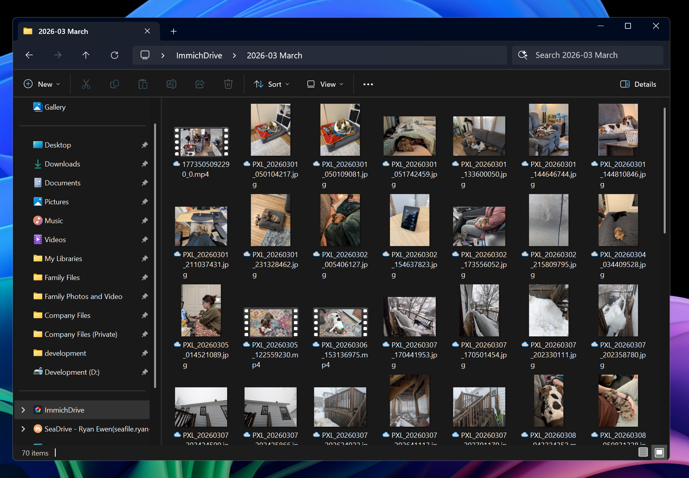
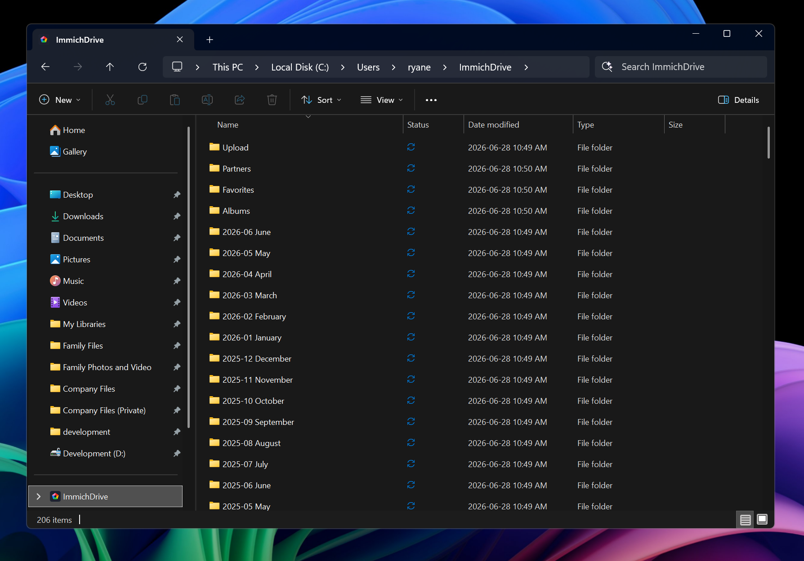
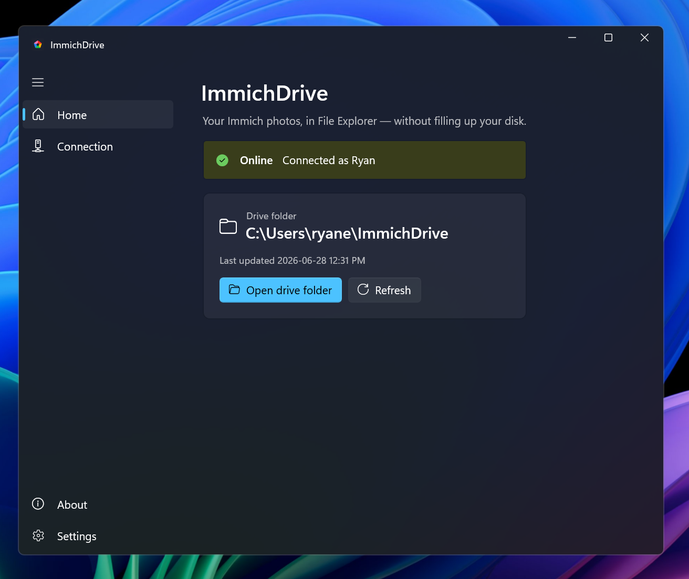
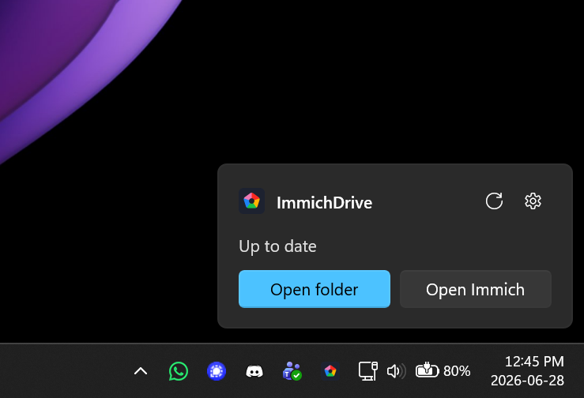

  

<h1 align="center">ImmichDrive</h1>

  Your <a href="https://immich.app">Immich</a> photo library as a native cloud drive in File Explorer — on demand, without storing the photos on your PC.

  

  

  
  &nbsp;&nbsp;
  

Take a photo on your phone, let it auto-sync to Immich, and then grab it straight from your
computer's file picker — no need to open the Immich web UI, download anything by hand, or
fill up your disk. When you actually open or attach a photo, ImmichDrive fetches just that
file on demand and hands it to whatever app asked for it (great for attaching a recent photo
to a Craigslist listing, an email, or a form).

## How it works

ImmichDrive uses the same Windows mechanism as OneDrive and Dropbox — the **Cloud Files API**
— to create *placeholder* files. They look and behave like normal files in Explorer (correct
names, dates, and **thumbnails**) but take up **0 bytes** until you open one. Opening a file
("hydrating" it) streams the original down from your Immich server in the background; closing
and freeing space dehydrates it back to a placeholder.

- **Organized the way you think about it** — `2026-06 June` date folders (newest first), plus
  **Albums**, **Favorites**, and **Partners** folders that mirror Immich and stay in sync.
- **Real thumbnails without downloading** — a lightweight shell extension fetches Immich's
  small thumbnails so you can *see* your photos before opening them, with nothing on disk.
- **Lives in the tray** — a single tray icon shows status (online / syncing) and lets you
  open settings, refresh, or pause. No heavyweight background service.

## Setup (minimal)

1. Install **ImmichDrive** from the [Microsoft Store](https://apps.microsoft.com/detail/9MWC6165N7DH).
2. Open **ImmichDrive** and enter:
   - your **Immich server URL** (e.g. `https://photos.example.com`)
   - an **API key** (Immich → *Account Settings → API Keys → New API Key*).
3. Click **Test connection**, then **Connect**. Your drive appears in Explorer under
   *ImmichDrive* (a sync-root entry in the navigation pane, like OneDrive).

That's it — browse by date and double-click (or attach) any photo.

## Requirements

- **Windows 11** (build 22621 or newer) — ImmichDrive relies on the Cloud Files API and modern shell thumbnails.
- **An Immich server** you can reach (any reasonably recent version), and an **API key** from it.

## Development

Building from source, the MSIX packaging pipeline, and how the pieces fit together — the resident
app, the thumbnail shell extension, the Cloud Files provider, and the on-disk index — are
documented in **[DEVELOPMENT.md](DEVELOPMENT.md)**.

## License

Licensed under the [PolyForm Noncommercial License 1.0.0](LICENSE.md): free for any
**personal and other noncommercial use**, including modifying and redistributing it.
**Commercial use is not permitted.** Copyright © 2026 Ryan Ewen.
